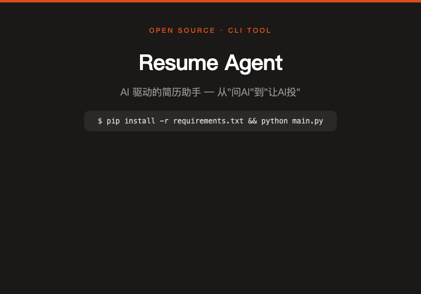
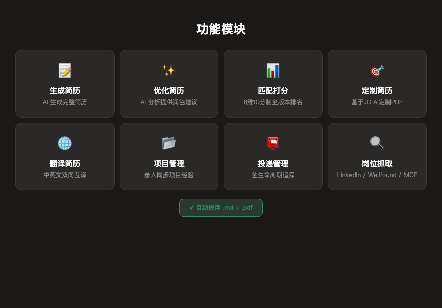
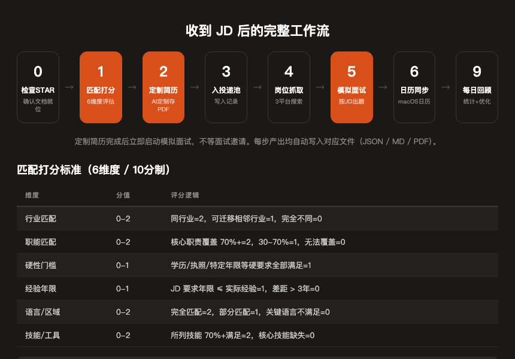
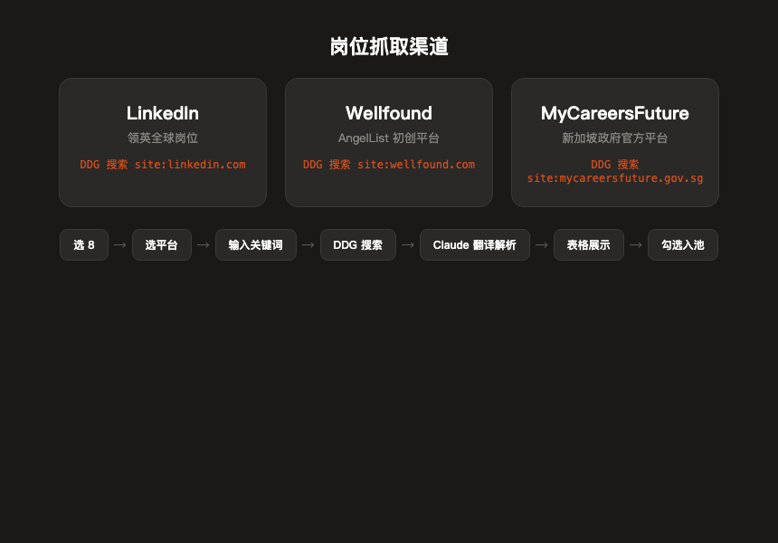
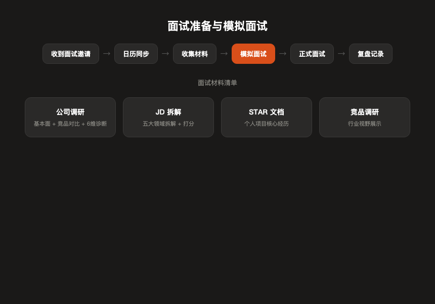

AI-powered resume assistant — match scoring, generation, customization, translation, job scraping, and interview prep. All from the terminal.

## Quick Start

```bash
cd ~/Desktop/resume-agent
pip install -r requirements.txt
cp .env.example .env
# Add your ANTHROPIC_API_KEY to .env
python main.py
```

## Features



| # | Module | Description |
|---|--------|-------------|
| 1 | **Generate** | Fill in your info, AI generates a complete resume (auto-saves .md + .pdf) |
| 2 | **Optimize** | Upload your resume, AI analyzes and suggests improvements |
| 3 | **Match Score** | Paste a JD, AI scores all your resume versions across 6 dimensions |
| 4 | **Customize** | AI tailors your resume to a specific JD (auto-saves .md + .pdf) |
| 5 | **Translate** | Bidirectional Chinese ↔ English translation |
| 6 | **Projects** | CRUD for project experience, referenced during optimization |
| 7 | **Tracker** | Full application lifecycle tracking + end-of-day review |
| 8 | **Job Scraping** | Search LinkedIn / Wellfound / MyCareersFuture, AI translates JDs |

## Workflow & Scoring



### Matching Rubric (6 dimensions / 10-point scale)

| Dimension | Score | Logic |
|-----------|-------|-------|
| Industry Fit | 0-2 | Same industry=2, adjacent=1, unrelated=0 |
| Role Fit | 0-2 | 70%+ core duties covered=2, 30-70%=1 |
| Hard Requirements | 0-1 | Degree/license/years all met=1 |
| Experience Years | 0-1 | JD requirement ≤ actual experience=1 |
| Language/Region | 0-2 | Full match=2, partial=1 |
| Skills/Tools | 0-2 | 70%+ skills met=2, core skill missing=0 |

> **8-10** priority apply | **6-7** okay | **5** borderline | **< 5** skip

### Standard Pipeline

```
Receive JD → Match Score → Customize Resume → Add to Pool
    → Scrape Jobs → Mock Interview → Calendar Sync → Daily Review
```

## Job Scraping



| Platform | Method | Scope |
|----------|--------|-------|
| LinkedIn | DuckDuckGo `site:linkedin.com/jobs/view` | Global, keyword search |
| Wellfound | DuckDuckGo `site:wellfound.com/jobs` | Startups, past week |
| MyCareersFuture | DuckDuckGo `site:mycareersfuture.gov.sg` | Singapore gov, past month |

All scraped jobs are parsed by Claude, displayed in a table, and batch-added to your application pool.

## Interview Prep



Mock interviews start immediately after resume customization — no need to wait for an interview invitation.

## Project Structure

```
resume-agent/
├── main.py                  # CLI entry point
├── agent/                   # Core modules
│   ├── generator.py         # Resume generation
│   ├── customizer.py        # JD-tailored customization
│   ├── matcher.py           # 6-dimension scoring
│   ├── optimizer.py         # Resume optimization
│   ├── translator.py        # CN ↔ EN translation
│   ├── linkedin_jobs.py     # LinkedIn scraper
│   ├── wellfound_jobs.py    # Wellfound scraper
│   ├── mycareersfuture_jobs.py  # MCF scraper
│   ├── job_scraper_menu.py  # Unified scraper menu
│   ├── daily_job_scanner.py # Automated daily scan
│   ├── project_experience.py # Project CRUD
│   └── applicant_tracker.py # Application + interview tracking
├── prompts/                 # Claude system prompts
├── utils/                   # Resume parsing, formatting, Notion sync
├── data/                    # JSON storage
└── website/                 # Project website
```

## Tech Stack

**Python** · **Claude API** (Anthropic SDK) · **Rich** (terminal UI) · **fpdf2** (PDF generation) · **PyMuPDF** (PDF parsing) · **DuckDuckGo Search** · **Notion API** (optional sync)

## License

MIT
